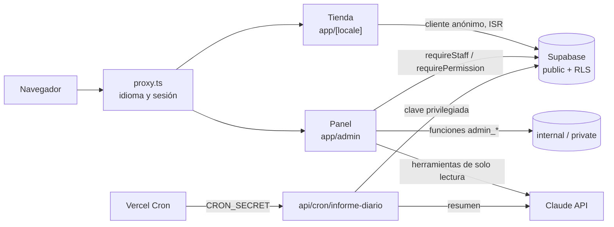

# Arquitectura

Partes técnicas de la Fase 0 consolidadas con lo implementado hasta el cierre de la Fase 1 (02/10/2026). Las decisiones y sus cambios están en [DECISIONS.md](DECISIONS.md); la base de datos, en [DATABASE.md](DATABASE.md); la seguridad, en [SECURITY.md](SECURITY.md).

## Visión general

Monolito Next.js con módulos de dominio (ADR-001), desplegado en Vercel, con Supabase como base de datos, autenticación y almacenamiento.

| Pieza          | Versión instalada (exacta)                                                        |
| -------------- | --------------------------------------------------------------------------------- |
| Node / pnpm    | 24.16.0 (`.nvmrc`) / 11.19.0                                                      |
| Next.js        | 16.3.6, App Router, compilado con webpack (DECISIONS §11)                         |
| React          | 19.3.0                                                                            |
| TypeScript     | 6.0.3, estricto                                                                   |
| Tailwind CSS   | 4.3.3                                                                             |
| next-intl      | 4.14.7                                                                            |
| Supabase       | `@supabase/supabase-js` 2.117.2, `@supabase/ssr` 0.12.7, CLI 2.118.0, Postgres 17 |
| zod            | 4.6.5                                                                             |
| 3D y animación | three 0.186.1, @react-three/fiber 9.8.1, @react-three/drei 10.7.9, motion 13.4.4  |
| Asistente      | `@anthropic-ai/sdk` 0.130.0                                                       |
| Pruebas        | Vitest 5.0.2, Playwright 1.63.0, pgTAP                                            |

## Capas y módulos

- `src/app/` solo compone rutas: páginas, layouts, Server Actions finas y Route Handlers.
- `src/modules/<dominio>/` contiene la lógica:
  - `domain/`: reglas puras y probadas, sin E/S;
  - `server/`: acceso a datos y casos de uso, con `import 'server-only'`;
  - `ui/`: componentes del dominio;
  - `index.ts`: API pública segura para el cliente; `server.ts`: API de servidor.
- `src/lib/`: infraestructura compartida (clientes de Supabase, dinero, CSV, identificadores de petición).

| Módulo                | Qué hace                                                                       |
| --------------------- | ------------------------------------------------------------------------------ |
| `auth`                | Matriz de permisos, decisión de acceso al panel, sesión, MFA, invitaciones     |
| `admin`               | Piezas comunes del panel: `useAdminAction`, `Sheet`, avisos, búsqueda          |
| `catalog`             | Perfumes, formatos, imágenes, importación CSV, lecturas de la tienda           |
| `pricing`             | Margen, Ómnibus, revisión de cambios de PVP y cambios masivos (dominio puro)   |
| `inventory`           | Movimientos, recuentos, niveles y vigilante de stock                           |
| `purchasing`          | Proveedores, pedidos de compra, recepciones y propuestas de reposición         |
| `reports`             | Existencias y cierre, rotación, márgenes, compras y auditoría                  |
| `assistant`           | Informe diario, resumen y chat con herramientas de solo lectura                |
| `content`             | Portada y datos de la tienda con borrador, revisiones y publicación            |
| `storefront`          | Componentes y lecturas de la tienda pública                                    |
| `i18n`                | Rutas por idioma, carga de mensajes, metadatos y `buildAlternates`             |
| `unboxing`            | Escena 3D bajo demanda de la ficha                                             |
| `brand`               | Logotipo y nombre de la marca                                                  |
| `design`              | Catálogo de tokens, matriz de contraste y página de referencia `/admin/diseno` |
| `orders`, `messaging` | Reglas puras preparadas para pedidos y mensajes (fases A5 y A6), sin pantallas |

Reglas de importación: los componentes de cliente solo importan `index.ts`; los secretos y el acceso privilegiado solo existen en módulos `server-only`; `@typescript-eslint/no-explicit-any` y `consistent-type-imports` son errores.

## Renderizado y datos

- **Tienda:** páginas estáticas con ISR de 5 minutos, leídas con un cliente anónimo sin cookies (`createSupabasePublicClient`); el panel revalida al guardar (DECISIONS §36). Nunca ve costes ni unidades.
- **Vista previa del personal:** Draft Mode de Next, que se activa solo desde el panel con `catalog.edit` y MFA; en ese modo la tienda lee con la sesión y la RLS decide (DECISIONS §47).
- **Panel:** dinámico, `private, no-store`, con la sesión del usuario (`createSupabaseServerClient`). Escrituras sensibles mediante funciones `admin_*`.
- **Dinero:** céntimos enteros; IVA y porcentajes en puntos básicos ([PRICING.md](PRICING.md)).

| Cliente de Supabase          | Clave                          | Uso                                            |
| ---------------------------- | ------------------------------ | ---------------------------------------------- |
| `createSupabaseServerClient` | Publicable + cookies de sesión | Panel y vista previa                           |
| `createSupabasePublicClient` | Publicable, sin cookies        | Tienda estática                                |
| `createAuthAdminClient`      | Secreta                        | Solo invitaciones de Auth, tras `staff.manage` |
| `createJobClient`            | Secreta                        | Solo el informe diario (cron o `reports.view`) |

## Tareas programadas y asistente

Vercel Cron (`vercel.json`, 05:15 UTC) llama a `/api/cron/informe-diario` con `CRON_SECRET`; guarda el informe del día anterior y su resumen. El chat del panel (`/admin/asistente/consulta`) usa el _tool runner_ del SDK de Anthropic con herramientas zod de solo lectura que leen con la sesión de quien pregunta (DECISIONS §77–81).

## Despliegue y entornos

| Entorno    | Dónde                                                                 | Base de datos                               |
| ---------- | --------------------------------------------------------------------- | ------------------------------------------- |
| Local      | `pnpm dev` (webpack, `localhost`); Supabase local con Docker opcional | Local o `adhara-dev`                        |
| CI         | GitHub Actions: `ci.yml`, `db.yml`, `e2e.yml`                         | Supabase local efímero                      |
| Preview    | Vercel, una por rama y PR                                             | `adhara-dev`                                |
| Production | Vercel desde `main`, funciones en París (cdg1)                        | `adhara-dev` hasta que exista `adhara-prod` |

Todos los despliegues de Vercel están protegidos con Vercel Authentication y responden `noindex`. No se despliega a producción por defecto (AGENTS.md).

## Diferencias con la Fase 0

- Español, catalán e inglés desde el principio, con prefijo (ADR-010 sustituye a ADR-008).
- Roles `system_admin`, `store_admin` y `viewer` en lugar de los cuatro de la Fase 0 (DECISIONS §14).
- Esquema de catálogo simplificado, sin taxonomía ni claims todavía (DECISIONS §30 y §86).
- Parte visual (tienda animada, 3D del piloto) adelantada por decisión del usuario (DECISIONS §27).
- Pagos: la Fase 0 suponía Stripe; el usuario cobrará con un TPV de tarjeta y el proveedor está pendiente (DECISIONS §82).
