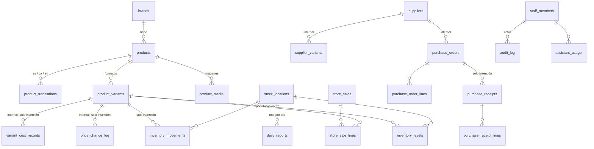

# Base de datos

Supabase (Postgres 17) con tres esquemas. Estado al 02/10/2026: 17 migraciones, las mismas en local, en CI y en `adhara-dev` (Frankfurt, `eu-central-1`). Este documento describe lo implementado; el diseño original de la Fase 1 está en `docs/source/FASE_1_PLAN.md` §7–§9 y las diferencias, en [DECISIONS.md](DECISIONS.md).

## Esquemas

| Esquema    | Expuesto por la API | Contenido                                                                                                         | Acceso                                                                                                   |
| ---------- | ------------------- | ----------------------------------------------------------------------------------------------------------------- | -------------------------------------------------------------------------------------------------------- |
| `public`   | Sí                  | Catálogo, inventario, personal, auditoría, contenido de la tienda, informes diarios y uso del asistente           | RLS en todas las tablas; escritura sensible solo mediante funciones `admin_*`                            |
| `internal` | No                  | Costes, historial de PVP, proveedores, pedidos de compra, recepciones y control (tareas, costes y entregas)       | Sin privilegios para `anon` ni `authenticated`; solo funciones `SECURITY DEFINER` con permiso y MFA      |
| `private`  | No                  | Funciones auxiliares (`has_permission`, `current_aal`, triggers), revisiones de PVP y de contenido, preasignación | `authenticated` puede usar el esquema para que las políticas llamen a sus funciones; sin acceso a tablas |

`supabase/config.toml` expone solo `public` y `graphql_public`. En `adhara-dev`, una petición REST a `internal` o `private` con la clave publicable responde `PGRST106` («Only the following schemas are exposed: public, graphql_public»), comprobado el 02/10.

## Migraciones

Una migración por tema, aplicadas en `adhara-dev` con el conector de Supabase y guardadas con la misma versión en `supabase/migrations/` (DECISIONS §19).

| Versión          | Tema                                                                                                                 |
| ---------------- | -------------------------------------------------------------------------------------------------------------------- |
| `20260929170331` | Extensiones, esquemas `internal` y `private`, `set_updated_at`, `reject_mutation` (solo inserción)                   |
| `20260929170455` | Personal, permisos, matriz de roles, auditoría y `has_permission` / `current_aal`                                    |
| `20260929170513` | Índices de claves foráneas del personal                                                                              |
| `20260929220732` | Catálogo: marcas, perfumes, textos, formatos, imágenes, historial de PVP, reglas de publicación y de precio, buckets |
| `20260929220840` | Inventario: ubicaciones, niveles, movimientos y funciones de movimiento y recuento                                   |
| `20260929224423` | Gestión del personal desde el panel                                                                                  |
| `20260929230737` | Niveles de stock borrados con su formato                                                                             |
| `20260929232007` | Roles preasignados por email                                                                                         |
| `20260930045615` | Costes internos por formato (solo inserción)                                                                         |
| `20260930083657` | Registro de costes por lotes                                                                                         |
| `20260930220818` | Guardas de MFA y del último administrador                                                                            |
| `20260930220820` | Ediciones seguras: revisiones de PVP, foto principal única, precio anterior y auditoría del catálogo                 |
| `20260930220822` | Contenido de la tienda con borrador, revisiones y publicación                                                        |
| `20260930220824` | Invitaciones del personal                                                                                            |
| `20260930224000` | Compras a proveedor, mostrador y vigilante de reposición                                                             |
| `20261001090000` | Informes (existencias, cierre, compras)                                                                              |
| `20261002044249` | Informe diario y uso del asistente                                                                                   |
| `20261009150000` | Perfil olfativo de cada perfume (catálogo olfativo de la tienda)                                                     |
| `20261009150100` | Suscriptores a promociones y alta pública `newsletter_subscribe`                                                     |
| `20261010120000` | Control del negocio: permiso `business.control`, precio cobrado en el mostrador y tareas, costes y entregas          |

No hay `seed.sql`: los datos de referencia (permisos, matriz de roles, ubicación de la tienda, parámetros del vigilante) viven en las migraciones. Las cargas de datos reales están en `supabase/data/` y se aplicaron una vez en `adhara-dev`; no forman parte de `db reset`.

## Tablas y RLS

Denegar por defecto: sin política, no hay acceso. «Público» es `anon` y también `authenticated` sin ficha de personal.

| Tabla                                                               | Público                                                                               | Personal (permiso)                                                                                          |
| ------------------------------------------------------------------- | ------------------------------------------------------------------------------------- | ----------------------------------------------------------------------------------------------------------- |
| `brands`                                                            | Marcas con algún perfume publicado                                                    | Lee todas; escribe con `catalog.edit`                                                                       |
| `products`                                                          | Publicados                                                                            | Lee todos; escribe con `catalog.edit`; publicar o retirar exige `catalog.publish` (trigger)                 |
| `product_translations`                                              | Textos de perfumes publicados                                                         | Lee todos; escribe con `catalog.edit` o `content.edit`                                                      |
| `product_variants`                                                  | Formatos activos de perfumes publicados                                               | Lee todos; escribe con `catalog.edit`; PVP y precio anterior solo con `pricing.edit_retail` y MFA (trigger) |
| `product_media`                                                     | Imágenes de perfumes publicados                                                       | Lee todas; escribe con `media.edit`                                                                         |
| `product_scent_profiles`                                            | Perfiles de perfumes publicados                                                       | Lee todos; escribe con `catalog.edit` o `research.edit`. Notas como claves; fuente `https` obligatoria      |
| `newsletter_subscribers`                                            | Ni lee ni escribe; solo da de alta con `newsletter_subscribe()`                       | Lee con `customers.view`; da de baja o borra con `customers.manage` (MFA); nadie inserta por la API         |
| `store_content`                                                     | La revisión publicada de la portada y los datos de la tienda                          | Escritura solo con `admin_*_content` (`content.edit` / `settings.manage`, con MFA)                          |
| `stock_locations`                                                   | —                                                                                     | Lee el personal; escribe con `settings.manage`                                                              |
| `inventory_levels`, `inventory_movements`                           | —                                                                                     | Lee con `inventory.view`; escribe solo mediante funciones                                                   |
| `store_sales`, `store_sale_lines`                                   | —                                                                                     | Lee con `inventory.view`; escribe `admin_record_store_sale`                                                 |
| `stock_watch_settings`                                              | —                                                                                     | Lee con `inventory.view`; escribe `admin_set_stock_watch_settings` (`settings.manage`)                      |
| `staff_members`                                                     | —                                                                                     | Cada miembro lee su ficha; `staff.manage` gestiona                                                          |
| `permissions`, `role_permissions`                                   | —                                                                                     | Lee el personal; nadie escribe por la API                                                                   |
| `audit_log`                                                         | —                                                                                     | Lee `staff.manage`; se escribe con `record_audit_event` y triggers                                          |
| `daily_reports`                                                     | —                                                                                     | Lee `agent.use`; solo escribe el servidor con la clave privilegiada                                         |
| `assistant_usage`                                                   | —                                                                                     | Cada persona inserta y ve lo suyo con `agent.use` y MFA; `staff.manage` ve todo                             |
| `internal.*`                                                        | Inalcanzable                                                                          | Solo mediante funciones `admin_*`                                                                           |
| `storage.objects`: `product-media` (público), `editorial` (privado) | `product-media`: lectura pública; `editorial`: solo la imagen de la portada publicada | `product-media`: escribe `media.edit`; `editorial`: lee y sube el personal con permiso de contenido         |

Además, `anon` y `authenticated` no tienen `TRUNCATE` en ninguna tabla pública y `anon` no tiene `INSERT`, `UPDATE` ni `DELETE` (pgTAP `07`).

### Solo inserción

`UPDATE` y `DELETE` fallan para todos los roles, incluido el propietario de la base (`private.reject_mutation`, error `42501`): `audit_log`, `inventory_movements`, `store_sales`, `store_sale_lines`, `assistant_usage`, `internal.price_change_log`, `internal.variant_cost_records`, `internal.purchase_receipts`, `internal.purchase_receipt_lines` y `private.store_revisions`.

## Funciones

Todas las funciones `admin_*` son `SECURITY DEFINER` con `search_path` vacío, comprueban el permiso (y MFA cuando el permiso lo exige) al empezar y no son ejecutables por `anon`. El asesor de Supabase las marca como ejecutables por `authenticated`: es intencionado (DECISIONS §20 y §35).

| Área       | Funciones                                                                                                                                                                                                                                                                                                                                                                                                                                                                                         | Permiso                                                                                                                                     |
| ---------- | ------------------------------------------------------------------------------------------------------------------------------------------------------------------------------------------------------------------------------------------------------------------------------------------------------------------------------------------------------------------------------------------------------------------------------------------------------------------------------------------------- | ------------------------------------------------------------------------------------------------------------------------------------------- |
| Precios    | `admin_review_price`, `admin_apply_price_review`, `admin_variant_price_history`                                                                                                                                                                                                                                                                                                                                                                                                                   | `pricing.edit_retail` (+ `pricing.view_cost` al revisar); historial también con `catalog.edit`                                              |
| Costes     | `admin_variant_costs`, `admin_record_variant_cost`, `admin_record_variant_costs`                                                                                                                                                                                                                                                                                                                                                                                                                  | `pricing.view_cost` / `pricing.edit_cost`                                                                                                   |
| Imágenes   | `admin_set_primary_media`                                                                                                                                                                                                                                                                                                                                                                                                                                                                         | `media.edit`                                                                                                                                |
| Inventario | `admin_record_inventory_movement`, `admin_record_stocktake`, `admin_inventory_once`, `admin_set_reorder_point`, `admin_stock_watch_facts`, `admin_set_stock_watch_settings`                                                                                                                                                                                                                                                                                                                       | Según el tipo de movimiento (`private.movement_permission`), `inventory.stocktake`, `inventory.adjust`, `inventory.view`, `settings.manage` |
| Mostrador  | `admin_record_store_sale`                                                                                                                                                                                                                                                                                                                                                                                                                                                                         | `inventory.sell_in_store`                                                                                                                   |
| Compras    | `admin_list_suppliers`, `admin_save_supplier`, `admin_save_supplier_variant`, `admin_remove_supplier_variant`, `admin_assign_supplier_brand`, `admin_supplier_terms`, `admin_create_purchase_order`, `admin_update_purchase_order`, `admin_delete_purchase_order`, `admin_transition_purchase_order`, `admin_set_purchase_order_lines`, `admin_list_purchase_orders`, `admin_purchase_order_lines`, `admin_purchase_order_receipts`, `admin_receive_purchase_order`, `admin_open_purchase_orders` | `purchasing.manage` (+ `pricing.view_cost` / `pricing.edit_cost` con importes); pedidos abiertos con `inventory.view`                       |
| Informes   | `admin_report_inventory_period`, `admin_report_purchases`                                                                                                                                                                                                                                                                                                                                                                                                                                         | `reports.view` / `purchasing.manage` (+ `pricing.view_cost` para importes)                                                                  |
| Control    | `admin_control_tasks`, `admin_control_save_task`, `admin_control_set_task_status`, `admin_control_delete_task`, `admin_control_costs`, `admin_control_save_cost`, `admin_control_delete_cost`, `admin_control_deliveries`, `admin_control_save_delivery`, `admin_control_delete_delivery`, `admin_control_month_facts`                                                                                                                                                                            | `business.control` (solo `system_admin`)                                                                                                    |
| Contenido  | `admin_get_content`, `admin_save_content`, `admin_publish_content`, `admin_restore_content`                                                                                                                                                                                                                                                                                                                                                                                                       | `private.check_content_access`: `content.edit` (portada) o `settings.manage` (datos de la tienda), con MFA                                  |
| Personal   | `admin_list_staff`, `admin_grant_staff`, `admin_set_staff_active`, `admin_prepare_invite`, `admin_pending_invites`, `admin_cancel_invite`                                                                                                                                                                                                                                                                                                                                                         | `staff.manage`                                                                                                                              |
| Otras      | `record_audit_event` (personal activo), `storefront_availability` (pública: solo disponible, últimas unidades o agotado), `newsletter_subscribe` (pública: alta normalizada, sin revelar si existía, con freno de 60 altas por minuto)                                                                                                                                                                                                                                                            | —                                                                                                                                           |

`admin_stock_watch_facts` y `admin_open_purchase_orders` aceptan también `service_role` para la tarea programada del informe diario (`private.is_service_role()`).

## Diagrama

## Pruebas y comprobaciones

| Qué                                       | Dónde                                                                             | Cuándo                         |
| ----------------------------------------- | --------------------------------------------------------------------------------- | ------------------------------ |
| pgTAP (329 pruebas en 10 archivos)        | `supabase/tests/database/`, `pnpm test:db`                                        | `db.yml`, en cada PR y en main |
| Tipos generados iguales a las migraciones | `scripts/check-db-types.ts`                                                       | `db.yml`                       |
| `supabase db lint` (plpgsql_check)        | `scripts/check-db-lint.ts`, con 3 falsos positivos conocidos de tablas temporales | `db.yml`                       |
| Concurrencia real (24 sesiones)           | `supabase/tests/concurrency/`, `scripts/test-concurrency.ts`                      | `db.yml`                       |
| Coste centinela fuera de la tienda        | `tests/fixtures/test-db.sql` + `tests/e2e/cost-leak.spec.ts`                      | `e2e.yml`                      |

Archivos pgTAP: `01` personal y permisos, `02` catálogo e inventario, `03` costes, `04` entregas de administración y compras/mostrador, `05` informes, `06` asistente `07` garantías de la Fase 1 (RLS en todas las tablas, `anon` sin funciones `admin_*`, PVP sin permiso, publicación y solo inserción) `08` perfil olfativo y suscriptores (lectura pública solo de publicados, restricciones del perfil, alta pública normalizada que no revela si el email existía, lectura y baja solo con `customers.*`) y `09` control del negocio (solo `system_admin` con MFA, `internal` inalcanzable, auditoría sin importes, precio cobrado en el mostrador sin superar el PVP y hechos del mes).

`db reset` solo se ejecuta en local y en CI. En `adhara-dev` borraría datos reales (catálogo, stock, fotos y cuentas): allí se comprueba la paridad de versiones con la lista de migraciones (DECISIONS §85).
