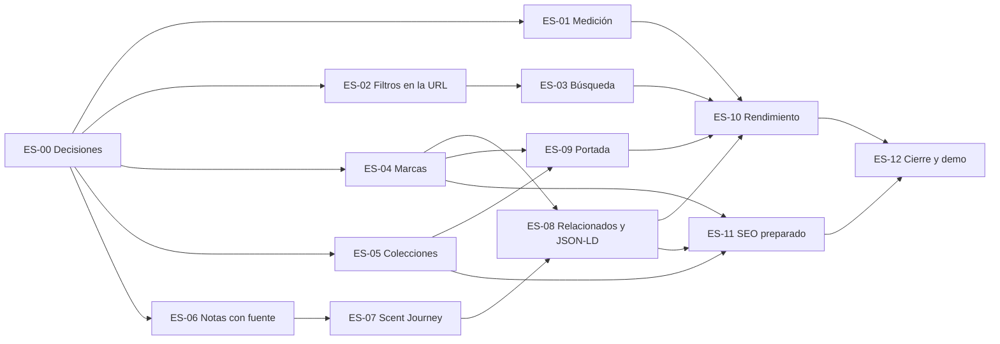

# Bloque «Escaparate» — plan (F5, F6, F13 y parte de F16)

Estado: **propuesta, pendiente de aprobar (ES-00)**. Preparado el 05/10/2026 a petición del usuario: avanzar lo que no depende de terceros antes de presentar la web al cliente.

Base:

- roadmap de la Fase 0 (`docs/source/FASE_0_ARQUITECTURA.md` §4, §7, §12 y §17), filas F5, F6, F13, F15 y F16;
- estado real del 04/10 ([STATUS.md](../STATUS.md) y [ROADMAP.md](../ROADMAP.md));
- sistema de diseño de la Fase 2 ([DESIGN_SYSTEM.md](../DESIGN_SYSTEM.md), [FASE_2_REPORT.md](FASE_2_REPORT.md));
- regla de datos de producto ([PRODUCT_RESEARCH.md](../PRODUCT_RESEARCH.md)): nada inventado, todo con procedencia.

Las tareas están pensadas para repartirse: cada una cabe en una rama y una PR, con su alcance, sus dependencias, su tamaño (S, M o L) y su criterio de hecho.

## 1. Para qué sirve este bloque

Que el cliente pueda **recorrer la tienda como un comprador**: entrar por la portada, explorar el catálogo real por marca, colección o búsqueda, abrir una ficha completa con su perfil olfativo y saltar a perfumes relacionados. Todo rápido en el móvil, accesible y en los tres idiomas.

Es lo que más se ve en una presentación y **no espera** al TPV, al proveedor de correo ni a los datos legales (DECISIONS §82). El checkout (F10) sigue siendo la prioridad de negocio en cuanto lleguen esos datos; este bloque no la retrasa, porque no toca carrito, pedidos ni inventario.

**Fuera de alcance:** carrito y checkout (F10), Click & Collect y `/tienda` (F12), cuenta de cliente (F14), páginas legales y producción (F17), el research completo de la F4 (claims, conflictos y completitud), escenas 3D para más perfumes (F8), fotografía propia y analítica.

## 2. Punto de partida (inventario del 05/10)

| Área            | Qué hay hoy                                                                                                                | Qué falla o falta                                                                                                                              |
| --------------- | -------------------------------------------------------------------------------------------------------------------------- | ---------------------------------------------------------------------------------------------------------------------------------------------- |
| Colección       | `/catalogo` en es/ca/en con ISR (300 s). `CatalogBrowser` filtra por marca y público y ordena en el navegador (`useState`) | Los filtros no van en la URL: no se comparten, no funcionan sin JS y el botón Atrás los pierde. Sin paginación. Los filtros miden 36 px (`sm`) |
| Búsqueda        | Campo de texto dentro de `CatalogBrowser`, solo en el navegador                                                            | Sin entrada desde la cabecera ni URL de resultados                                                                                             |
| Marcas          | `public.brands` con `slug` y `name`. Marquesina de nombres en la portada                                                   | Sin `/marcas` ni `/marca/[slug]`, sin texto de marca y sin pantalla en el panel                                                                |
| Colecciones     | Tonos de colección (oud, índigo y bosque) definidos en la Fase 2 (D3), sin uso                                             | No existen tablas, rutas ni pantalla en el panel                                                                                               |
| Notas olfativas | Nada. La taxonomía no se siembra (DECISIONS §86)                                                                           | Sin notas no hay Scent Journey ni filtro por nota                                                                                              |
| Ficha           | Galería o escena 3D bajo demanda (`next/dynamic`), formatos, PVP, disponibilidad, descripción y detalles                   | Sin Scent Journey, sin migas de pan, sin JSON-LD. «Relacionados» son solo los de la misma marca                                                |
| Portada         | Hero, textos de la tienda e imagen editables (borrador, vista previa y publicación). Destacados por la casilla `featured`  | El orden de los destacados y los textos de «Experiencia» no se editan. La marquesina no enlaza a ninguna parte                                 |
| SEO             | Canonical y hreflang por idioma; `noindex` global y `robots.ts` con `disallow: /` mientras la web sea privada              | Sin sitemap ni descripciones por página; sin imagen para compartir                                                                             |
| Rendimiento     | Fuentes autoalojadas, 3D fuera del bundle inicial, `prefers-reduced-motion` global                                         | Nadie mide Lighthouse, LCP, CLS ni el peso del JS. No hay presupuestos                                                                         |
| Calidad         | axe y auditoría de maquetación bloqueantes a 4 anchos; prueba de fuga de costes; pgTAP de RLS                              | Las rutas nuevas tendrán que entrar en esas mismas redes                                                                                       |
| Datos           | 424 perfumes del PDF y 34 de la compra en borrador; 50 publicados con PVP; imágenes provisionales con procedencia          | Pocos perfumes publicados para una demo de catálogo; importar el CSV con costes sigue pendiente del usuario                                    |

## 3. Objetivos al terminar el bloque

1. **Catálogo navegable de verdad:** filtros, orden, búsqueda y paginación en la URL, que funcionan sin JS y se pueden compartir.
2. **Marcas y colecciones:** índice y página de cada marca; colecciones curadas desde el panel, con los tonos de la Fase 2.
3. **Ficha completa:** Scent Journey cuando hay notas con fuente, migas de pan, relacionados por afinidad y datos estructurados válidos.
4. **Portada editorial:** destacados elegidos y ordenados desde el panel, colección destacada y bloques que enlazan con el resto de la tienda.
5. **Rápida y medida:** Lighthouse móvil, LCP, CLS y peso de JS con presupuestos que fallan en la CI.
6. **Preparada para indexar** el día que se abra, sin abrir nada todavía.
7. **Lista para enseñar:** guion de la demo y revisión aprobada por el usuario en la Preview.

## 4. Criterios de finalización

El bloque está terminado solo si se cumplen todos, con evidencia en el informe (salida de pruebas o enlaces a la CI).

| #   | Criterio                                                                                                                                                                               | Cómo se comprueba                                                         |
| --- | -------------------------------------------------------------------------------------------------------------------------------------------------------------------------------------- | ------------------------------------------------------------------------- |
| 1   | Las rutas nuevas existen en es, ca y en con su ruta traducida, y los mensajes de `ca` y `en` tienen las mismas claves que `es`                                                         | `i18n.test.ts` y E2E por idioma                                           |
| 2   | Solo aparecen perfumes **publicados** en colección, búsqueda, marcas, colecciones, relacionados, portada, sitemap y JSON-LD. Una marca o colección sin publicados no se muestra        | E2E con un perfume en borrador como centinela; pgTAP de las tablas nuevas |
| 3   | Ningún coste ni dato del esquema `internal` en el HTML, el RSC ni las respuestas de las rutas nuevas                                                                                   | `cost-leak.spec.ts` ampliado a todas las rutas nuevas                     |
| 4   | Filtros, orden, búsqueda y paginación funcionan **sin JS** y viven en la URL. Canonical sin filtros; `noindex` en combinaciones filtradas y en resultados de búsqueda                  | E2E con JavaScript desactivado y prueba unitaria de la metadata           |
| 5   | Toda nota olfativa publicada tiene fuente (URL y fecha de consulta) visible en el panel; sin fuente no se puede guardar                                                                | Restricción en SQL con pgTAP y prueba de la acción                        |
| 6   | La ficha funciona sin notas, sin precio, sin imagen y sin 3D sin romper la maquetación                                                                                                 | E2E con perfumes de prueba en cada caso y auditoría de maquetación        |
| 7   | JSON-LD `Product` con `Offer` por formato y `BreadcrumbList`, válido. **Nunca** reseñas ni valoraciones                                                                                | Prueba unitaria de la forma y Rich Results Test (por código) en 3 fichas  |
| 8   | Las tablas nuevas tienen RLS y pruebas pgTAP de autorización; las pantallas nuevas del panel usan `requirePermission` y exigen MFA para escribir                                       | `pnpm test:db` y E2E del panel con sesión                                 |
| 9   | Lighthouse móvil ≥ 90 en rendimiento y en accesibilidad en portada, colección y ficha; LCP < 2,5 s y CLS < 0,1 en laboratorio                                                          | Lighthouse en la CI (mediana de 3 pasadas)                                |
| 10  | JS de primera carga de la ficha ≤ 170 KB gzip y 0 bytes de three.js en el bundle inicial                                                                                               | Script de presupuesto sobre la salida del build                           |
| 11  | Siguen valiendo los criterios de la Fase 2: axe sin infracciones, sin solapes a 390, 768, 1280 y 1440 px, objetivos de 44 px en los controles principales y guardas de diseño en verde | Las auditorías existentes, ampliadas a las pantallas nuevas               |
| 12  | La portada solo usa perfumes e imágenes reales publicados, y sus bloques se editan desde el panel sin desplegar                                                                        | E2E de contenido con borrador, vista previa y publicación                 |
| 13  | Sin dependencias nuevas de producción; las de desarrollo, con versión exacta                                                                                                           | `package.json`                                                            |
| 14  | `ci.yml`, `db.yml` y `e2e.yml` en verde en cada PR del bloque                                                                                                                          | CI                                                                        |
| 15  | Guía, decisiones, STATUS, ROADMAP e informe al día                                                                                                                                     | Revisión                                                                  |
| 16  | Revisión aprobada por el usuario en la Preview, siguiendo el guion de la demo (§9)                                                                                                     | Aprobación escrita en la PR de cierre                                     |

## 5. Decisiones que necesito de ti

Cada una tiene una recomendación. Si no dices nada, se sigue la recomendación y queda registrada en DECISIONS.

| #   | Decisión                        | Recomendación                                                                                                                                                                                                                                                                                                                                                           |
| --- | ------------------------------- | ----------------------------------------------------------------------------------------------------------------------------------------------------------------------------------------------------------------------------------------------------------------------------------------------------------------------------------------------------------------------- |
| E1  | Notas olfativas (Scent Journey) | **Anticipo acotado de la F4:** notas por perfume en salida, corazón y fondo, cada una con su fuente obligatoria (URL y fecha), introducidas por el personal desde la web oficial de la marca o el distribuidor. La taxonomía crece con lo que se introduce (no se siembra). Sin notas, la ficha no muestra la sección. Se migrará a claims cuando llegue la F4 completa |
| E2  | Colecciones                     | Incluirlas: **curadas a mano** (sin reglas automáticas), con título y entradilla en es/ca/en, orden de perfumes, uno de los tonos de la Fase 2 y estado borrador o publicada. Los textos los escribe la tienda                                                                                                                                                          |
| E3  | Página de marca                 | Nombre, entradilla opcional en es/ca/en escrita por la tienda, enlace opcional a la web oficial y sus perfumes publicados. **Sin logotipos de marca** hasta tener los derechos                                                                                                                                                                                          |
| E4  | Búsqueda                        | En la propia colección con `?q=` (sin ruta `/buscar` aparte), sin acentos ni mayúsculas, sobre los perfumes publicados en el servidor. Sin migración ni motor de búsqueda mientras el catálogo publicado sea de cientos; se pasa a la búsqueda de texto de Postgres si crece a miles                                                                                    |
| E5  | Medición de rendimiento         | Lighthouse CI (`@lhci/cli`, versión exacta, solo desarrollo) dentro de `e2e.yml`, contra `next start` con Supabase local, perfil móvil y mediana de 3 pasadas. Presupuesto de JS con un script propio sobre la salida del build, sin dependencias                                                                                                                       |
| E6  | Portada                         | Bloques fijos en un orden fijo (sin constructor de páginas): hero, destacados (elegidos y ordenados en el panel), colección destacada, experiencia 3D, marcas (enlazadas), tienda y preguntas frecuentes. Mismo flujo de borrador, vista previa y publicación                                                                                                           |
| E7  | Filtros de la colección         | Pasan a 44 px (`md`): al llevarlos a la URL se convierten en el control principal de la colección. Cierra la duda que quedó abierta en la Fase 2 (DECISIONS §107)                                                                                                                                                                                                       |
| E8  | Rutas traducidas (propuesta)    | es `/marcas`, `/marca/[slug]`, `/colecciones`, `/coleccion/[slug]`; ca `/marques`, `/marca/[slug]`, `/colleccions`, `/colleccio/[slug]`; en `/brands`, `/brand/[slug]`, `/collections`, `/collection/[slug]`                                                                                                                                                            |

## 6. Tareas

Una tarea = una rama (`codex/es-NN-tema`, o la que asigne el entorno) y una PR con los tres workflows en verde. La casilla se marca al fusionar la PR.

ES-01, ES-02, ES-04, ES-05 y ES-06 pueden empezar en paralelo en cuanto esté ES-00. El camino más largo es ES-06 → ES-07 → ES-08 → ES-10 → ES-12.

### Preparación

- [ ] **ES-00 · Aprobar el plan y las decisiones E1–E8** (usuario).
  - Hecho cuando: la PR de este plan está fusionada y las decisiones constan en DECISIONS.

- [ ] **ES-01 · Medir antes de construir** (F16). Tamaño S. Depende de: ES-00.
  - Lighthouse CI (E5) sobre portada, colección y ficha en es, en perfil móvil.
  - Script `scripts/bundle-budget.ts` que lee la salida del build y mide el JS de primera carga por ruta, y comprueba que three.js no está en el bundle inicial de la ficha.
  - Informe inicial: no falla todavía, mide de dónde partimos (como la línea base de axe en DS-01).
  - Hecho cuando: el informe sale en cada ejecución de `e2e.yml` y la línea base está en la PR y en §10 de este plan.

### Catálogo (F5)

- [ ] **ES-02 · Filtros, orden y paginación en la URL.** Tamaño M. Depende de: ES-00.
  - La colección lee `searchParams` en el servidor: marca, público, concentración, rango de precio, disponibilidad y orden; paginación de 24 en 24 con enlaces.
  - Los filtros son un `<form method="get">` con enlaces reales: funcionan sin JS; con JS se aplican sin recargar y el botón Atrás los respeta.
  - Los datos se siguen leyendo cacheados (lista de publicados por etiqueta); solo el filtrado depende de la petición.
  - Metadata: canonical sin filtros y `noindex` con filtros (criterio 4).
  - Filtros a 44 px (E7) y resumen de filtros activos con «Quitar» por filtro y «Limpiar todo».
  - Hecho cuando: E2E con JS activado y desactivado, unitarias del parser de la URL (valores no válidos se ignoran, nunca rompen) y la colección sigue en las auditorías.

- [ ] **ES-03 · Búsqueda.** Tamaño S. Depende de: ES-02.
  - `?q=` en la colección (E4): sin acentos ni mayúsculas, sobre nombre, marca y concentración; combina con los filtros.
  - Entrada desde la cabecera con el icono «buscar» de la Fase 2: abre un `SearchField` que envía a la colección. Sin JS, la cabecera enlaza a la colección con el foco en el buscador.
  - Sin resultados: `EmptyState` con sugerencia de marcas y enlace a toda la colección.
  - `noindex` en resultados de búsqueda.
  - Hecho cuando: unitarias de la normalización (es, ca y en, con acentos y la `l·l` catalana) y E2E de búsqueda con y sin JS.

- [ ] **ES-04 · Marcas.** Tamaño M. Depende de: ES-00.
  - Migración: `brand_translations` (marca, idioma, entradilla) y `brands.website_url` opcional. RLS: lectura pública solo de marcas con algún perfume publicado. pgTAP.
  - Panel `/admin/marcas`: lista con el número de perfumes publicados y en borrador, y edición de nombre, entradilla y web, con `requirePermission('catalog.edit')`, MFA y registro en `audit_log`. Las marcas «por revisar» aparecen marcadas.
  - Tienda: `/marcas` (índice alfabético) y `/marca/[slug]` (entradilla, enlace a la web oficial si existe y sus perfumes publicados con los mismos filtros de ES-02 cuando estén). Rutas traducidas (E8).
  - La marquesina de la portada y la marca de la ficha enlazan a su página.
  - Revalidación por etiqueta `brand:{id}` al editar.
  - Hecho cuando: pgTAP, E2E de tienda y panel, auditorías y fuga de costes en las rutas nuevas.

- [ ] **ES-05 · Colecciones.** Tamaño M. Depende de: ES-00.
  - Migración: `collections` (slug, estado, orden, tono), `collection_translations` (título, entradilla) y `collection_products` (perfume y orden). RLS: solo publicadas y solo sus perfumes publicados. pgTAP.
  - Panel `/admin/colecciones`: crear, editar textos en es/ca/en, elegir y ordenar perfumes, elegir tono (oud, índigo o bosque) y publicar. Permiso de contenido, MFA y auditoría.
  - Tienda: `/colecciones` y `/coleccion/[slug]` con el tono elegido (`data-tone`). Una colección sin perfumes publicados no se muestra.
  - Revalidación por etiqueta `collection:{id}` al publicar.
  - Hecho cuando: pgTAP, E2E de tienda y panel, auditorías (los tonos oscuros también pasan axe) y fuga de costes.

### Ficha (F6)

- [ ] **ES-06 · Notas olfativas con fuente** (anticipo de la F4, E1). Tamaño M. Depende de: ES-00.
  - Migración: `scent_notes` (slug y nombre en es/ca/en) y `product_notes` (perfume, nota, fase `top`/`heart`/`base`, orden, `source_url`, `accessed_on`, autor). La fuente es obligatoria por restricción. RLS: lectura pública solo de notas de perfumes publicados. pgTAP.
  - Panel: sección «Notas» en la ficha del perfume, con `requirePermission('research.edit')`, MFA y auditoría. Al escribir una nota se sugieren las existentes; una nota nueva pide su nombre en los tres idiomas. Cada fila muestra su fuente.
  - Sin carga masiva ni notas generadas: el asistente no escribe notas.
  - Hecho cuando: pgTAP (sin fuente no se guarda; anónimo no ve notas de borradores), unitarias del dominio y E2E del panel.

- [ ] **ES-07 · Scent Journey.** Tamaño M. Depende de: ES-06.
  - Sección en la ficha con salida, corazón y fondo, renderizada en el servidor; solo se hidrata la animación (Fase 0 §12). Con «reducir movimiento», sin desplazamientos.
  - Fuente visible en pequeño («Notas según la web oficial de …»), enlazada.
  - Sin notas no se muestra nada (criterio 6).
  - Filtro «Nota» en la colección (ES-02), solo para notas con al menos 3 perfumes publicados.
  - Hecho cuando: E2E con y sin notas, auditorías y axe, y la sección en `/admin/diseno` si añade una pieza nueva a la biblioteca.

- [ ] **ES-08 · Relacionados, migas de pan y JSON-LD.** Tamaño M. Depende de: ES-04, ES-07.
  - Relacionados por afinidad en una función pura y probada: notas compartidas, misma marca, mismo público y concentración, precio cercano. Determinista y solo publicados.
  - Migas de pan visibles (Inicio › Marca › Perfume) y su `BreadcrumbList`.
  - `Product` con marca, imagen, descripción y un `Offer` por formato con precio, moneda EUR y disponibilidad real (nunca unidades). Sin `aggregateRating` ni `review` (criterio 7).
  - Hecho cuando: unitarias de la puntuación y del JSON-LD, y el código de 3 fichas validado en Rich Results Test (captura en la PR).

### Portada (F13)

- [ ] **ES-09 · Portada editorial.** Tamaño M. Depende de: ES-04, ES-05.
  - Contenido de portada ampliado (E6): destacados elegidos y ordenados (validados en el servidor contra perfumes publicados), textos de «Experiencia» y una colección destacada.
  - Marquesina de marcas con enlaces; accesos a colecciones y a la colección completa.
  - Mismo flujo de borrador, vista previa y publicación de `/admin/contenido`.
  - Si un destacado deja de estar publicado, desaparece de la portada sin romperla.
  - Hecho cuando: E2E de editar, previsualizar y publicar; criterio 12; auditorías.

### Endurecimiento (F16) y SEO (F15)

- [ ] **ES-10 · Rendimiento.** Tamaño M. Depende de: ES-01, ES-03, ES-08, ES-09.
  - Corregir lo que mida ES-01 y lo que añadan las tareas anteriores: `sizes` de imágenes y `priority` solo en la imagen LCP, `LazyMotion` en las islas de `motion`, CLS de la galería y las fuentes, peso del JS de la ficha.
  - Lighthouse y el presupuesto de JS pasan a **bloquear** (criterios 9 y 10).
  - Hecho cuando: los dos criterios pasan en `e2e.yml` en las tres páginas.

- [ ] **ES-11 · SEO preparado, sin abrir.** Tamaño S. Depende de: ES-04, ES-05, ES-08.
  - `sitemap.ts` con portada, colección, marcas, colecciones y fichas publicadas, con hreflang por idioma publicado. Sin URL `noindex`, filtradas ni de búsqueda.
  - El sitemap y el `robots.ts` abierto solo se activan con una variable de entorno de lanzamiento; hasta entonces todo sigue `noindex` y `disallow`.
  - Descripción y imagen para compartir por página (la imagen principal del perfume; las provisionales no se publican al abrir, ver §7).
  - Hecho cuando: unitarias del sitemap (sin borradores ni `noindex`) y E2E de que con la variable apagada todo sigue cerrado.

### Cierre

- [ ] **ES-12 · Documentación, demo y cierre.** Tamaño S. Depende de: ES-10, ES-11.
  - DECISIONS, STATUS, ROADMAP y `docs/ADMIN_OPERATIONS.md` (marcas, colecciones, notas y portada) al día.
  - Informe `docs/phases/ESCAPARATE_REPORT.md` con los criterios 1 a 16 y su evidencia.
  - Revisión del usuario en la Preview siguiendo el guion de §9 (criterio 16).
  - Hecho cuando: todos los criterios están cumplidos o tienen una excepción aceptada por escrito.

## 7. Lo que necesito de ti en paralelo

Nada de esto lo puede hacer el código; sin ello la demo enseña una tienda vacía o a medias.

1. **Aprobar la revisión visual de la Fase 2** en su PR de cierre (punto 12 de «Pendiente del usuario»).
2. **Importar el CSV con costes**, fijar PVP y **publicar un conjunto para la demo**: recomiendo al menos 24 perfumes (una página completa de la colección) de 5 o más marcas, con PVP, foto y texto en español.
3. **Notas olfativas** de 8 a 12 perfumes de ese conjunto, copiadas de la web oficial o del distribuidor con su URL. Puedo preparar propuestas con su enlace para que las compruebes una a una; ninguna se publica sin tu revisión.
4. **Textos de la tienda:** entradillas de 3 a 5 marcas y de 2 o 3 colecciones (por ejemplo, una por tono). Si los quieres en catalán e inglés, pásamelos o los traduzco y los revisas.
5. **Cómo accede el cliente a la Preview** (punto 3 de «Pendiente del usuario»): hoy Vercel Authentication solo deja pasar al titular.
6. **Derechos de las imágenes:** para la demo privada valen las provisionales; antes de abrir al público hacen falta los derechos o fotos propias.

## 8. Riesgos

| Riesgo                                                                      | Cómo se controla                                                                                                                      |
| --------------------------------------------------------------------------- | ------------------------------------------------------------------------------------------------------------------------------------- |
| Notas o textos sin fuente presentados como hechos                           | Fuente obligatoria en SQL (criterio 5); el asistente no escribe notas; los textos de marca y colección son editoriales y de la tienda |
| Filtrar en el servidor rompe la caché y encarece cada visita                | La lista de publicados se sigue leyendo cacheada por etiqueta; solo el filtrado es por petición. Lo vigila Lighthouse (ES-01)         |
| Lighthouse en la CI da resultados variables                                 | Mediana de 3 pasadas, servidor local sin red externa y umbrales del criterio 9; la línea base de ES-01 dice cuánto varía              |
| Fuga de costes por una consulta nueva                                       | Las rutas nuevas leen con el cliente anónimo y RLS; `cost-leak.spec.ts` ampliado (criterio 3)                                         |
| Demo con pocos perfumes publicados                                          | Depende del punto 2 de §7; la tienda se ve bien con poco catálogo (estados vacíos de la Fase 2), pero la demo pierde fuerza           |
| Crece el alcance (reglas automáticas de colecciones, research completo, 3D) | Colecciones curadas a mano, notas como anticipo acotado y 3D fuera; lo demás va a su fase                                             |
| Retrasa el checkout                                                         | El bloque no toca carrito, pedidos ni inventario; si llegan los datos del TPV, F10 pasa delante y este bloque sigue en paralelo       |

## 9. Guion de la demo (unos 10 minutos)

1. **Portada** en el móvil: hero, destacados, colección destacada y la tienda de Castelldefels.
2. **Colección:** filtrar por marca y precio, ordenar, compartir el enlace filtrado y volver atrás.
3. **Búsqueda** desde la cabecera, con y sin acentos.
4. **Marca** y **colección** con su tono.
5. **Ficha:** formatos y PVP, disponibilidad, Scent Journey con su fuente, escena 3D en uno de los perfumes del piloto y relacionados.
6. **Cambio de idioma** a catalán e inglés en la misma página.
7. **Panel:** editar la portada, previsualizar y publicar; crear una colección; añadir notas con su fuente.

Se enseña a partir de la Preview privada; el checkout se presenta como la siguiente fase, a la espera del TPV virtual.

## 10. Línea base (ES-01)

Pendiente: la rellena ES-01 con Lighthouse, LCP, CLS y JS de primera carga de portada, colección y ficha.
