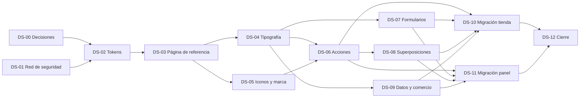

# Fase 2 — Sistema de diseño: plan

Estado: **PLAN, pendiente de aprobación** (no se ha implementado nada) · 02/10/2026.

Base:

- dirección de diseño de la Fase 0 (§13) y fila F2 del roadmap (§17);
- identidad definitiva L’Atelier du Désert (DECISIONS §56);
- sistema visual provisional de la PR #6 y piezas del panel de la PR #11;
- informe de la Fase 1 ([FASE_1_REPORT.md](FASE_1_REPORT.md)).

Las tareas están pensadas para repartirse: cada una cabe en una rama y una PR, con su alcance, sus dependencias y su criterio de hecho.

## 1. Para qué sirve esta fase

Un único lenguaje visual, accesible y documentado para la tienda y el panel. Las fases siguientes (catálogo, ficha, media y 3D en la tienda; checkout y mensajes en el panel) se construirán con estas piezas, sin estilos sueltos ni decisiones de diseño repetidas en cada pantalla.

**Fuera de alcance:** páginas o funciones nuevas (marcas, búsqueda, checkout), tipografía árabe, fotografía, cambios en la escena 3D y tema oscuro global.

## 2. Punto de partida (inventario del 02/10)

| Área        | Qué hay hoy                                                                                                                                         | Qué falla o falta                                                                                                                                                                                                    |
| ----------- | --------------------------------------------------------------------------------------------------------------------------------------------------- | -------------------------------------------------------------------------------------------------------------------------------------------------------------------------------------------------------------------- |
| Marca       | Logotipo definitivo vectorizado: sprite `public/brand/logo.svg` (emblema, wordmark y lockup) con `currentColor`; estrella de cuatro puntas          | Cumple «logo SVG». Faltan sus reglas de uso (tamaños mínimos, márgenes, fondos)                                                                                                                                      |
| Color       | 12 colores en `@theme` (`src/app/globals.css`): marfil, arena, tinta, noche, humo, niebla, línea, dorado, dorado suave, peligro, éxito              | Sin capa semántica; dos colores sueltos en CSS (`#fdfcf9`, `#fbf9f5`) y 12 usos de `bg-white`. Contraste (ver abajo)                                                                                                 |
| Contraste   | Tinta sobre marfil 16,5:1; humo sobre marfil 5,2:1; dorado suave sobre noche 11:1                                                                   | **Niebla sobre marfil 2,3:1** (35 textos con `text-mist`); **dorado sobre marfil 3,1:1** (textos dorados, y marfil sobre dorado en el botón principal al pasar el ratón); **bordes de campos 1,3:1** (WCAG pide 3:1) |
| Tipografía  | Cormorant Garamond (display) y Manrope (texto), autoalojadas con `next/font`                                                                        | Sin escala: 5 tamaños arbitrarios (uno de 9 px) y 8 valores distintos de espaciado en las versalitas                                                                                                                 |
| Componentes | Tienda: 11 en `modules/storefront/ui`. Panel: 11 en `modules/admin/ui` (`Sheet`, `Toaster`, `Field`, `SubmitButton`, `StatusBadge`, `SearchField`…) | Dos sistemas de botones (`.btn` en 46 sitios, `.panel-btn` en 20), `.input` en 94, 47 `<button>` y 22 `<select>` sueltos. No existe `src/components/ui`                                                              |
| Oscuro      | `bg-night` en secciones y `.sheet[data-tone='dark']`                                                                                                | Sin tokens de tono oscuro                                                                                                                                                                                            |
| Movimiento  | Curva `--ease-luxe`, 4 animaciones y `prefers-reduced-motion` global                                                                                | Sin duraciones como tokens                                                                                                                                                                                           |
| Calidad     | Auditoría manual de solapes (PR #11), E2E de rutas                                                                                                  | Sin axe, sin pruebas de teclado de componentes, sin página de referencia                                                                                                                                             |

## 3. Objetivos al terminar la fase

1. **Tokens en dos capas.**
   - Paleta de marca y tokens semánticos: superficie, texto, borde, acento, foco y estados.
   - También tipografía, espaciado y retícula, radios, líneas, capas y movimiento.
   - Un tono claro y tonos oscuros como «momentos».
2. **Contraste AA garantizado:** todas las combinaciones permitidas cumplen WCAG 2.2 AA, comprobado por una prueba.
3. **Una biblioteca de primitivas** en `src/components/ui/`, la misma para la tienda y el panel.
4. **Página interna de referencia** con todos los tokens y componentes en todos sus estados.
5. **Accesible por diseño:** teclado completo, foco visible, objetivos táctiles suficientes, `reduced-motion` y axe sin errores.
6. **Tienda y panel migrados** a las primitivas sin regresiones visuales.
7. **Documentado y aprobado:** guía del sistema, decisiones registradas y revisión visual aprobada por el usuario.

## 4. Criterios de finalización

La Fase 2 está terminada solo si se cumplen todos, con evidencia en el informe de la fase (salida de pruebas o enlaces a la CI).

| #   | Criterio                                                                                                                                                                           | Cómo se comprueba                                         |
| --- | ---------------------------------------------------------------------------------------------------------------------------------------------------------------------------------- | --------------------------------------------------------- |
| 1   | Ningún componente usa colores fuera de los tokens: ni hexadecimales, ni `rgb()`, ni colores de Tailwind (`bg-white`, `gray-*`…). Se exceptúa la escena 3D                          | Prueba unitaria que recorre `src/**/*.tsx` y el CSS       |
| 2   | Contraste AA en todas las combinaciones permitidas: texto ≥ 4,5:1 (≥ 3:1 si es grande); bordes de controles, iconos y foco ≥ 3:1. Vale para el tono claro y los oscuros            | Prueba unitaria con la matriz de combinaciones de la guía |
| 3   | Escala tipográfica cerrada: sin `text-[…]` ni `tracking-[…]` arbitrarios y ningún texto por debajo de 11 px                                                                        | Prueba unitaria y página de referencia                    |
| 4   | Existen las primitivas de §6 con sus variantes y estados, y no quedan clases sueltas `.btn`, `.panel-btn`, `.input` ni `.panel-card` en las pantallas                              | Prueba unitaria y revisión de la página de referencia     |
| 5   | Teclado: cada componente se recorre con Tab en orden visual; foco visible de ≥ 2 px con contraste ≥ 3:1; Esc cierra diálogos y paneles y devuelve el foco; Intro y Espacio activan | E2E sobre la página de referencia                         |
| 6   | axe sin infracciones de nivel WCAG 2.2 AA en la página de referencia, las rutas públicas (inicio, colección y ficha en es, ca y en) y las principales del panel                    | E2E con `@axe-core/playwright` en `e2e.yml`               |
| 7   | Sin solapes, texto fuera de su caja ni desplazamiento horizontal a 390, 768, 1280 y 1440 px en la tienda y el panel                                                                | E2E de auditoría visual (tarea DS-01)                     |
| 8   | Objetivos táctiles de ≥ 44 × 44 px en el panel y en los controles principales de la tienda; ≥ 24 × 24 px en todo (WCAG 2.5.8)                                                      | E2E de auditoría                                          |
| 9   | Duraciones y curvas desde tokens; con `prefers-reduced-motion` no hay desplazamientos ni animaciones en bucle                                                                      | E2E con la preferencia emulada                            |
| 10  | Guía `docs/DESIGN_SYSTEM.md` y decisiones en `docs/DECISIONS.md`                                                                                                                   | Revisión                                                  |
| 11  | `ci.yml`, `db.yml` y `e2e.yml` en verde en cada PR de la fase                                                                                                                      | CI                                                        |
| 12  | Sin dependencias nuevas de producción; solo `@axe-core/playwright` como desarrollo, con versión exacta                                                                             | `package.json`                                            |
| 13  | Revisión visual aprobada por el usuario en la Preview: página de referencia y capturas de la tienda y el panel                                                                     | Aprobación escrita en la PR de cierre                     |

## 5. Decisiones que necesito de ti

Cada una tiene una recomendación. Si no dices nada, se sigue la recomendación y queda registrada en DECISIONS.

| #   | Decisión             | Recomendación                                                                                                                                                                       |
| --- | -------------------- | ----------------------------------------------------------------------------------------------------------------------------------------------------------------------------------- |
| D1  | Tipografías          | Mantener Cormorant Garamond y Manrope: licencia OFL, ya autoalojadas y en línea con el logotipo                                                                                     |
| D2  | Oscuro               | Tonos oscuros solo como «momentos» (secciones editoriales, panel deslizante, menú móvil), como dice la Fase 0. Sin tema oscuro global ni automático por preferencia del sistema     |
| D3  | Tonos de colección   | Definir ya los tokens de los oscuros de materia (oud tostado, índigo nocturno y verde muy oscuro) y aprobarlos en la página de referencia. Se usarán en la tienda a partir de la F5 |
| D4  | Dorado               | Dorado plano solo como acento: líneas, estrella y estados activos. Para texto dorado, un tono más oscuro que pase AA. El botón principal pasa de dorado a tinta al pasar el ratón   |
| D5  | Iconos               | Juego propio de unos 12 iconos de trazo fino (1,5 px) sin librería externa                                                                                                          |
| D6  | Página de referencia | `/admin/diseno` (las rutas del panel están en español), visible para todo el personal con sesión                                                                                    |

Fuera de alcance salvo que lo pidas: tipografía árabe (necesita los nombres árabes con fuente, de la F4) y fotografía de producto.

## 6. Tareas

Una tarea = una rama (`codex/ds-NN-tema`, o la que asigne el entorno) y una PR con los tres workflows en verde. La casilla se marca al fusionar la PR.

DS-01 puede empezar ya. De DS-05 a DS-09 se pueden trabajar en paralelo cuando estén DS-03 y DS-04. DS-10 y DS-11 también son paralelas entre sí.

### Preparación

- [ ] **DS-00 · Aprobar el plan y las decisiones D1–D6** (usuario).
  - Hecho cuando: la PR de este plan está fusionada y las decisiones constan en DECISIONS.

- [ ] **DS-01 · Red de seguridad antes de tocar estilos.** Depende de: —.
  - Convertir la auditoría de solapes, texto fuera de su caja, desplazamiento horizontal y objetivos pequeños (usada en la PR #11) en un E2E:
    - rutas públicas a 390, 768, 1280 y 1440 px;
    - el panel con sesión local.
  - Añadir `@axe-core/playwright` (versión exacta, respetando la antigüedad mínima de pnpm).
  - Guardar un informe inicial de infracciones: no falla todavía, pero mide de dónde partimos.
  - Capturas «antes» como artefacto de la CI, no versionadas.
  - Hecho cuando: el E2E de auditoría pasa en `e2e.yml` y el informe inicial de axe está en la PR.

### Fundamentos

- [ ] **DS-02 · Tokens.** Depende de: DS-00, DS-01.
  - Capa de paleta (los colores de marca actuales) y capa semántica:
    - `surface`, `surface-raised`, `surface-sunken`;
    - `text`, `text-muted`, `text-inverse`;
    - `border`, `border-strong`;
    - `accent`, `accent-text`, `focus`;
    - `danger`, `success`, `warning`, con su fondo suave.
  - Tonos oscuros con `[data-tone='dark']` y los de colección (D3).
  - Escalas de tipografía (tamaño, interlineado y tracking), espaciado y retícula (contenedor, 12 columnas en escritorio y 4 en móvil, ritmo de sección), radios (0 y 2 px), líneas, capas (`z-index`) y movimiento (rápido 200 ms, base 400 ms, lento 600 ms, `ease-luxe`).
  - Corregir lo que falla el contraste. Propuestas medidas, a validar en esta tarea:
    - texto secundario en `smoke` (5,2:1) y `mist` solo decorativo;
    - texto dorado en torno a `#7f6236` (5,0:1 sobre marfil);
    - borde de controles en torno a `#8f8578` (3,2:1 sobre marfil, 3,5:1 sobre el fondo del campo).
  - Pruebas de los criterios 1 a 3. Empiezan con una lista de excepciones de las pantallas aún no migradas, que debe quedar vacía en DS-11.
  - Hecho cuando: los tokens están en `globals.css`, las pruebas de contraste pasan y la lista de excepciones está escrita.

- [ ] **DS-03 · Página de referencia `/admin/diseno`.** Depende de: DS-02.
  - Protegida con `requireStaff` y enlazada desde el pie del menú del panel, fuera de las secciones de trabajo.
  - Muestra colores con su contraste calculado, escala tipográfica, espaciado, radios, movimiento y tonos claro y oscuro.
  - Cada tarea siguiente añade la sección de sus componentes.
  - E2E: sin sesión redirige al acceso y con sesión responde 200; axe sin infracciones.
  - Hecho cuando: la página existe con todos los tokens.

- [ ] **DS-04 · Tipografía.** Depende de: DS-03.
  - Componentes `Heading` (display, h1–h4), `Text` (cuerpo, pequeño y cifras tabulares) y `Eyebrow` (versalitas).
  - Sustituir los tamaños y trackings arbitrarios en toda la aplicación.
  - Hecho cuando: el criterio 3 pasa sin excepciones.

- [ ] **DS-05 · Iconos y marca.** Depende de: DS-03.
  - Componente `Icon` con el juego propio (D5): cerrar, menú, buscar, flecha, chevron, más, menos, check, alerta, información, carrito y usuario.
  - `Star` como viñeta, separador y cargador.
  - Reglas de uso del logotipo: tamaño mínimo, margen y fondos permitidos.
  - Hecho cuando: los iconos tienen `aria-hidden` o etiqueta, hay sección en la página de referencia y se revisaron los iconos de la aplicación (favicon y apple-icon).

### Primitivas

- [ ] **DS-06 · Acciones.** Depende de: DS-04, DS-05.
  - `Button`:
    - variantes principal, secundaria, contorno, sutil y peligro;
    - tamaños sm, md y lg (md y lg de 44 px);
    - estados de carga (con la estrella), deshabilitado y como enlace.
  - `TextLink` con subrayado animado y `SubmitButton` basado en `Button`.
  - Hecho cuando: hay estados en la página de referencia y E2E de teclado.

- [ ] **DS-07 · Formularios.** Depende de: DS-04.
  - `Field` (etiqueta, ayuda y error con `aria-describedby` y `aria-invalid`).
  - `Input`, `Textarea`, `Select`, `Checkbox`, `Radio` y `SearchField`.
  - Estados de foco, error, deshabilitado y solo lectura, con 44 px de alto.
  - Hecho cuando: hay estados en la página de referencia, E2E de teclado y axe sin infracciones.

- [ ] **DS-08 · Superposiciones y avisos.** Depende de: DS-06.
  - `Dialog`: `<dialog>` nativo, foco atrapado, Esc y foco devuelto.
  - `Sheet`: se mueve de `modules/admin/ui` a la biblioteca, con lado y tono.
  - `Toast` con `aria-live` y confirmación de acciones destructivas.
  - Respetan `reduced-motion`.
  - Hecho cuando: el criterio 5 pasa en la página de referencia.

- [ ] **DS-09 · Datos y comercio.** Depende de: DS-04.
  - `Tag` y `Badge`: estados de publicación, de stock y de pedido; sustituye a `StatusBadge`.
  - `Price`:
    - PVP en el formato de cada idioma;
    - precio anterior tachado con texto accesible («antes»);
    - «desde» y cifras tabulares.
  - `Table`, con la variante apilada de móvil, y `Card`, `EmptyState` y `Skeleton`.
  - Hecho cuando: hay estados en la página de referencia y las pruebas unitarias de `Price` cubren es, ca y en, con y sin rebaja.

### Migración

- [ ] **DS-10 · Migrar la tienda.** Depende de: DS-06, DS-07, DS-08 y DS-09.
  - Cabecera, pie, portada, colección y filtros, tarjeta de perfume, ficha y panel de compra, 404 y banner de vista previa.
  - Sin cambios de contenido ni de rutas.
  - Hecho cuando: los criterios 1, 3, 4, 6 y 7 pasan en las rutas públicas y las capturas están en la PR.

- [ ] **DS-11 · Migrar el panel.** Depende de: DS-06, DS-07, DS-08 y DS-09.
  - Menú y diseño general, acceso y MFA, y las pantallas de catálogo, inventario, mostrador, compras, reposición, informes, contenido, configuración, equipo y asistente.
  - Eliminar `.btn`, `.panel-btn`, `.input`, `.panel-card` y los colores sueltos. La lista de excepciones de DS-02 queda vacía.
  - Hecho cuando: los criterios 1, 4, 6, 7 y 8 pasan en el panel con sesión (`e2e.yml`).

### Cierre

- [ ] **DS-12 · Documentación, revisión y cierre.** Depende de: DS-10 y DS-11.
  - `docs/DESIGN_SYSTEM.md`: principios, tokens, matriz de contraste, uso de cada componente con lo que se hace y lo que no, y movimiento.
  - DECISIONS, STATUS y ROADMAP al día.
  - Revisión visual del usuario en la Preview (criterio 13).
  - Informe `docs/phases/FASE_2_REPORT.md` con los criterios 1 a 13 y su evidencia.
  - Hecho cuando: todos los criterios están cumplidos o tienen una excepción aceptada por escrito.

## 7. En paralelo: preparación de la Fase 3

No depende de esta fase y la hace el usuario desde el panel:

- importar el CSV del catálogo con costes (Catálogo → Importar);
- revisar las marcas «por revisar», los 6 perfumes sin marca y las fotos.

## 8. Riesgos

| Riesgo                                                      | Cómo se controla                                                                                        |
| ----------------------------------------------------------- | ------------------------------------------------------------------------------------------------------- |
| Regresiones visuales al migrar                              | DS-01 antes de tocar nada; capturas antes y después en cada PR de migración                             |
| Corregir el contraste cambia la sensación de la marca       | Los valores se validan en la página de referencia y los apruebas tú (criterio 13)                       |
| Capas de Tailwind 4: las utilidades ganan a los componentes | Primitivas con utilidades y variantes, no clases de componente que compitan (lo aprendido en la PR #11) |
| axe señala el lienzo 3D o falsos positivos                  | Excluir solo el `<canvas>` con justificación escrita; nada más se excluye                               |
| Crecer el alcance (páginas nuevas, rediseños)               | Solo migración con el mismo contenido y las mismas rutas; lo nuevo va a su fase                         |
| Tiempo de CI                                                | axe y auditoría dentro de `e2e.yml`, que ya levanta el servidor                                         |
